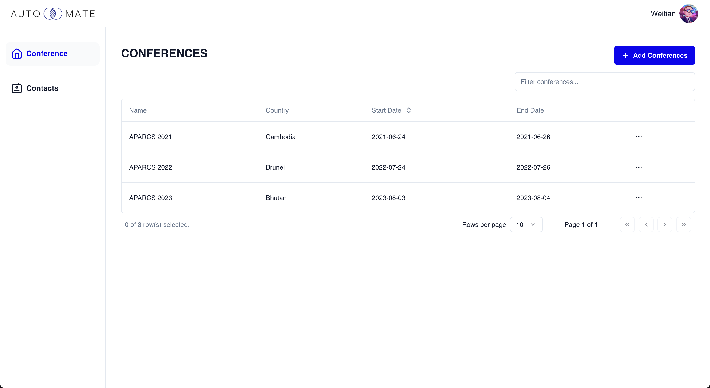
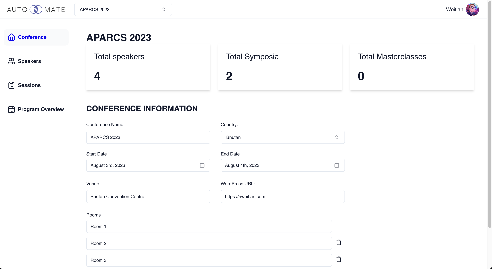
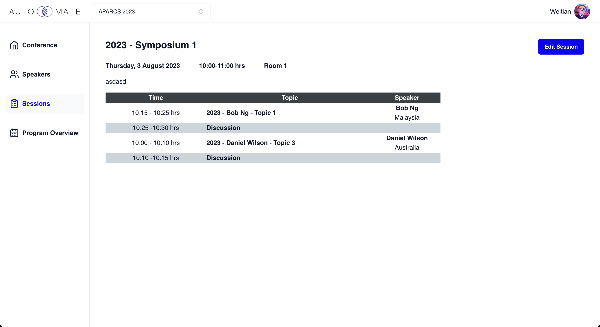
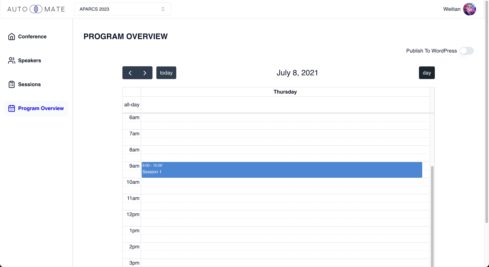
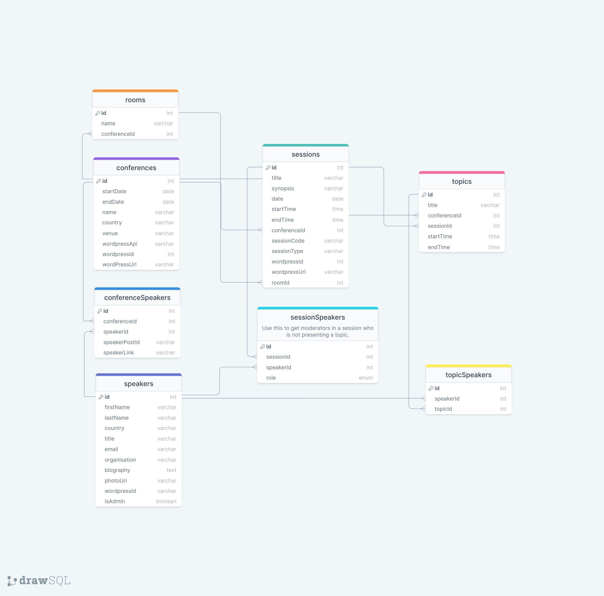

# AutoMate

A conference speaker management application that integrates with websites built with WordPress.

## Live Site

[https://automate.hweitian.com/](https://automate.hweitian.com/)

Login with the following:  
Email: contact.invoicegenie@gmail.com  
PW: geNie@89757

## Screenshots







## Main Features

- Create conference and link each conference to a WordPress website 
- Add contacts and assign contact as a speaker for each conference
- Add a contact as the administrator of the system
- CRUD sessions and publish it user specified WordPress website
- Create program overview and publish it on user specified WordPress website
- Create speaker's presentation schedule based on the assigned topics in each session

## Tech Used

- Frontend: [React](https://react.dev/)
- Backend: [Express.js](https://expressjs.com/)
- Database: [Sequelize (ORM)](https://sequelize.org/), [PostgreSQL](https://www.postgresql.org/)
- Routing: [React Router](https://reactrouter.com/en/main)
- UI: [Shadcn](https://ui.shadcn.com/)
- Storage: [Firebase](https://firebase.google.com/)
- Forms: [React Hook Forms](https://react-hook-form.com/)
- Authentication: [Auth0](https://auth0.com/)
- API: [WordPress API](https://developer.wordpress.org/rest-api/), [SendGrid](https://sendgrid.com/)

## Setup

### Frontend Folder
1. Clone repo to local

2. Configure `.env` file, make sure to get your own API keys stated below and insert it into your `.env` file

   - If unsure where to get API keys, refer to the Tech Used for the documents

   ```
   VITE_DOMAIN= <Auth0 Domain>
   VITE_CLIENT_ID= <Auth0 client id>
   VITE_AUDIENCE= <Auth0 app audience>
   VITE_BASE_URL= <Local Backend server URL>
   VITE_APP_BASE_URL= <Backend server URL> (only required if not running server locally) 
   VITE_APP_FIREBASE_API= <Firebase API key>
   VITE_ENV=development
   ```

3. `npm i` to install all dependencies

4.  `npm start` to run the application

### Backend Folder
1. `npm i` to install dependencies
2. Install and start postgresql database locally
3. `npx sequelize db:create` to create database
4. `npx sequelize db:migrate` to create tables
5. `npx sequelize db:seed:all` to create seed data
6. Create an [Auth0](https://auth0.com/) account and setup an Auth0 API and Applications
7. Create a [SendGrid](https://sendgrid.com/) account, setup Sending Identity and generate an API key
8. Create your WordPress website and setup API Authentication with [miniOrange WordPress Rest API](https://plugins.miniorange.com/wordpress-rest-api-authentication)

  ```
  DB_USERNAME=postgres
  DB_PASSWORD= <Postgres database password>
  DB_NAME= <Postgres database name>
  DB_HOST= <Postgres database host>
  DB_DIALECT=postgres
  PORT=3000
  NODE_ENV=development

  AUDIENCE= <Auth0 Domain>
  BASEURL= <Auth0 base URL>
  AUTH_CONNECTION_ID= <Auth0 Authentication database identifier>
  AUTH_DOMAIN= <Auth0 API domain>
  AUTH_CLIENTID= <Auth0 client id>
  AUTH_SECRET= <Auth0 Machine to Machine client secret key>
  AUTH_REDIRECTURL= <Frontend Application URL>
  AUTH_CONNECTION= <Auth0 database name>
  AUTH_TEMP_PW= <Temporary Password - Can be anything>
  SENDGRID_API_KEY= <SendGrid API Key>
  SG_EMAIL= <Email address configured in SendGrid>
  WORDPRESS_NAME= <WordPress login name>
  WORDPRESS_PW= <WordPress login password>
  ```

9. `npm run devStart` to run database locally

## Entity Relationship Diagram (ERD)


## Furture Features

- Notify user if there is a conflict in speaker's presentation schedule when adding a speaker to a session
- Reorganise topics in each session with drag-and-drop
